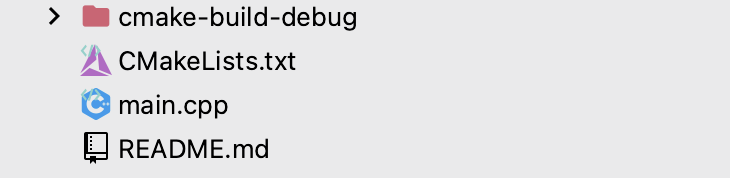
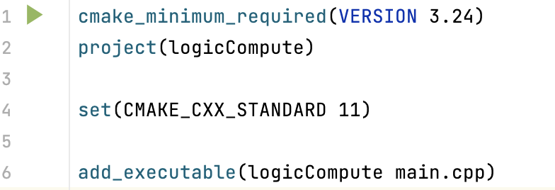

# CMake的使用

CMake是一个跨平台构建系统，CMake通过构建文件控制构建过程，但是CMake并不直接构建生成目标，而是产生**其他构建系统**需要的文件，因此可以满足跨平台的需求。

Clion较好的支持了CMake的使用，下面以Clion为例

先创建一个C++可执行程序项目，在项目文件下有

* main.cpp:自动生成的源文件
* cmake-build-debug:Clion调用CMake生成的默认构建目录。用于存储构建系统文件（比如makefile以及其他的一些cmake相关配置文件）和构建输出文件（编译生成中间文件，可执行文件和库）的顶级目录
* CMakeLists.txt:项目顶级目录的cmake配置文件

我们看看Clion提供的顶级目录配置文件有什么内容



* 第一行设置了cmake的最低版本要求，如果cmake的版本低于最低运行版本将会报错
* 第二行设定了项目的名称，并将其存储在cmak的内置变量`PROJECT_NAME`中。当从顶级CMakeLists.txt调用时，还将其存储在变量`CMAKE_PROJECT_NAME`中
* 第三行设定了C++标准的版本
* 第四行添加了一个可执行文件类型的构建项目，第一个参数是项目名称，后面是生成这个可执行文件需要的源文件列表

我们随机构建一个项目，可以参照另一个仓库：logicCompute

我们有一些附加选项

### 明确C++标准版本

Clion自动生成的`CMAKE_CXX_STANDARD`只是一个可选的属性，如果编译器不支持将会退化到之前版本

如果我们要强行明确标准版本

```python
set(CMAKE_CXX_STANDARD_REQUIRED True)
```

这样之后如果编译器不支持此版本会之间报错

## 生成项目构建系统

这一步是一个项目配置过程，并没有发生任何的编译工作。cmake根据项目的CMakeLists.txt文件在构建目录中生成对应构建系统的构建文件，同时也包含了很多cmake相关的配置文件。不过我们并不需要关心其内容

对于Clion我们可以直接一键生成构建系统，所以我们就可以简单使用CMake了，关于如何自建构建系统，下一次再说吧

